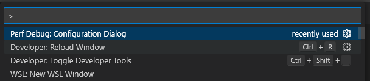

# GLIMPS
VS Code extension used in the SoftVR user study (https://git.informatik.uni-leipzig.de/SWS/softvr-user-study)

## Installation

The following commands will create the VSIX package containing the extension:
```
npm install
vsce package
```
This results in a `perf-debug-0.0.1.vsix` inside the root folder.
For installing the extension in VS Code use:
```
code --install-extension perf-debug-0.0.1.vsix
```
You may need to reload the VS Code window.

## Usage
GLIMPS can only be used with the following three software systems.
- Example System: https://git.informatik.uni-leipzig.de/qb19zexe/perf-debug-config
- Density Converter: https://git.informatik.uni-leipzig.de/qb19zexe/density-converter.git
- Berkeley DB: https://git.informatik.uni-leipzig.de/qb19zexe/berkeley-db.git

### Get Started
1. Clone one of the listed repositories.
2. Open the repository in VS Code.
3. Switch to the <b>user-study</b> branch.
4. Press `Ctrl+Shift+P` or `F1` and select `Perf Debug: Configuration Dialog` <br>

<br>

## Known issues
The extension does not start on Ubuntu 21.10 and 22.04 (but 20.04 is fine) in combination
with VS Code version 1.62+ (october 2021 and newer).
When working on Ubuntu 21.10+, we recommend to install the VS Code version 1.61 (https://code.visualstudio.com/updates/v1_61).
