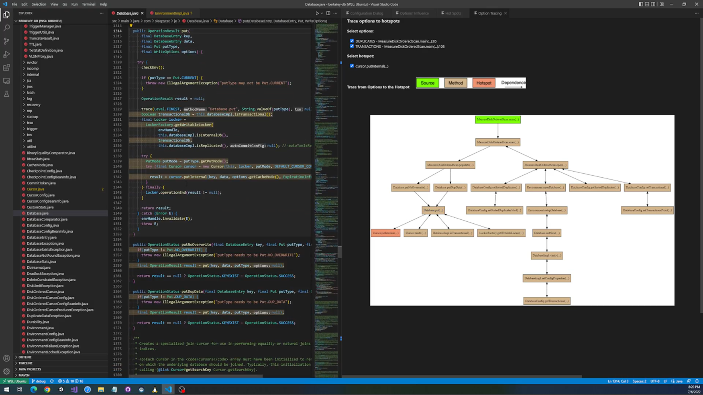
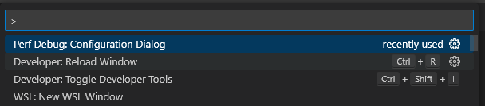
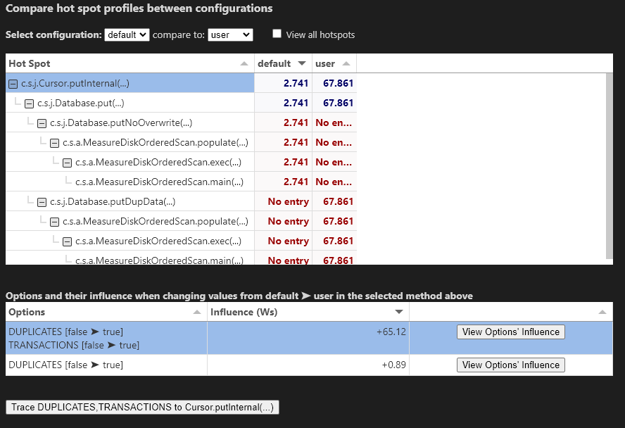
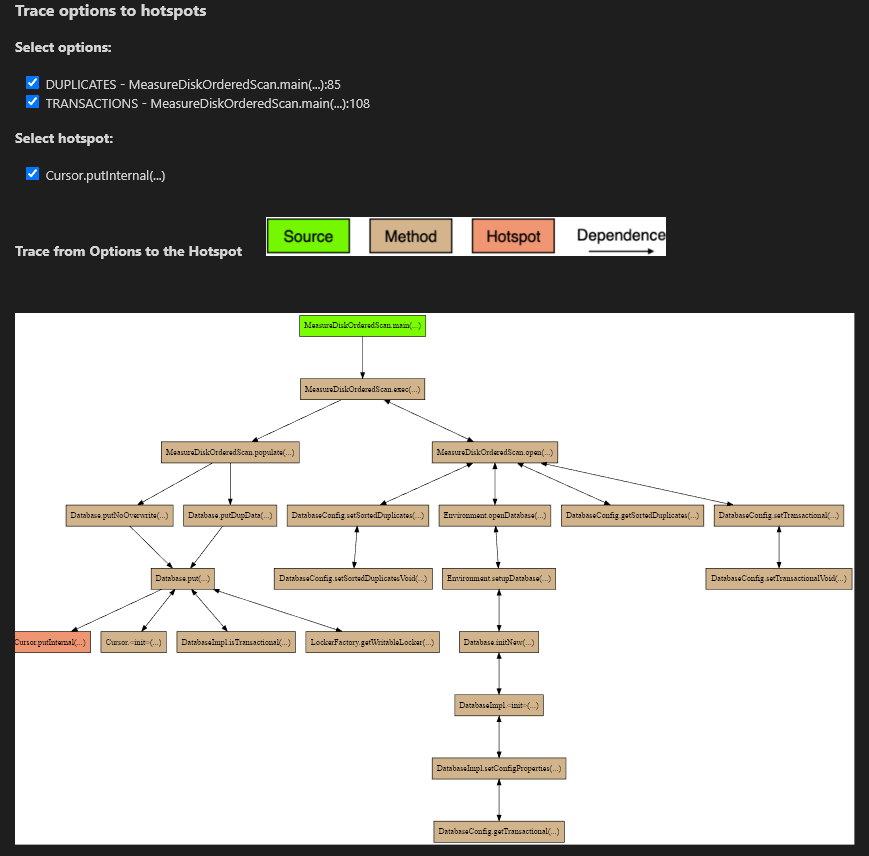

# GLIMPS
A research tool for debugging performance in software systems.


Modified and easily reproducible version of the original tool (https://github.com/miguelvelezmj25/glimps).

## Features
- <b>Influencing Options</b>: Displaying the options with the biggest impact on performance.
- <b>Option Hotspots</b>: Show where in the code the influencing options effect the performance.
- <b>Option-Hotspot Trace</b>: Reduce the codebase to the parts which are effected by an option.

## Installation
You must install the extension and run two local servers to be able to use all features of GLIMPS.
The two servers can be run using the docker images provided in `./servers`.

### Extension
The following commands will create the VSIX package containing the extension:
```
npm install
vsce package
```
This results in a `perf-debug-0.0.1.vsix` inside the root folder.
For installing the extension in VS Code use:
```
code --install-extension perf-debug-0.0.1.vsix
```
You may need to reload the VS Code window.<br>

### Hotspot Diff Server
Inside the root folder run:
```
docker load -i ./servers/hotspot-diff-server.tar
```
This adds the image to your local docker images.

### Joana Slicer Server
Inside the root folder run:
```
docker load -i ./servers/joana-slicer-server.tar
```
This adds the image to your local docker images.

## Usage
As of now, GLIMPS can only be used with the following three software systems, because only those contain the required resources (i.e. profiler measurements, ML models, program slices):
- Example System: https://git.informatik.uni-leipzig.de/qb19zexe/perf-debug-config
- Density Converter: https://git.informatik.uni-leipzig.de/qb19zexe/density-converter.git
- Berkeley DB: https://git.informatik.uni-leipzig.de/qb19zexe/berkeley-db.git

### Get Started
1. Clone one of the listed repositories.
2. Open the repository in VS Code.
3. Switch to the <b>user-study</b> branch.
4. Start the two servers with 
```
docker run -it -p 8001:8001 hotspot-diff-server
docker run -it -p 8002:8002 -p 8003:8003 -p 8025:8025 joana-slicer-server
```
5. Press `Ctrl+Shift+P` or `F1` and select `Perf Debug: Configuration Dialog` <br>

<br>

### Hotspot View (works only if the <b>hotspot diff server</b> runs)



### Option-Hotspot Trace (works only if the <b>joana slicer server</b> runs)



## Known issues
The extension does not start on Ubuntu 21.10 and 22.04 (but 20.04 is fine) in combination
with VS Code version 1.62+ (october 2021 and newer).
When working on Ubuntu 21.10+, we recommend to install the VS Code version 1.61 (https://code.visualstudio.com/updates/v1_61).
